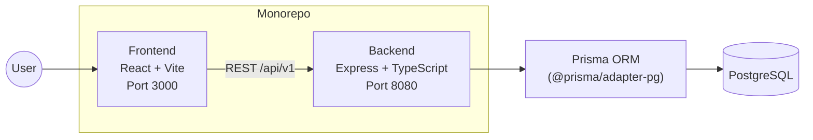
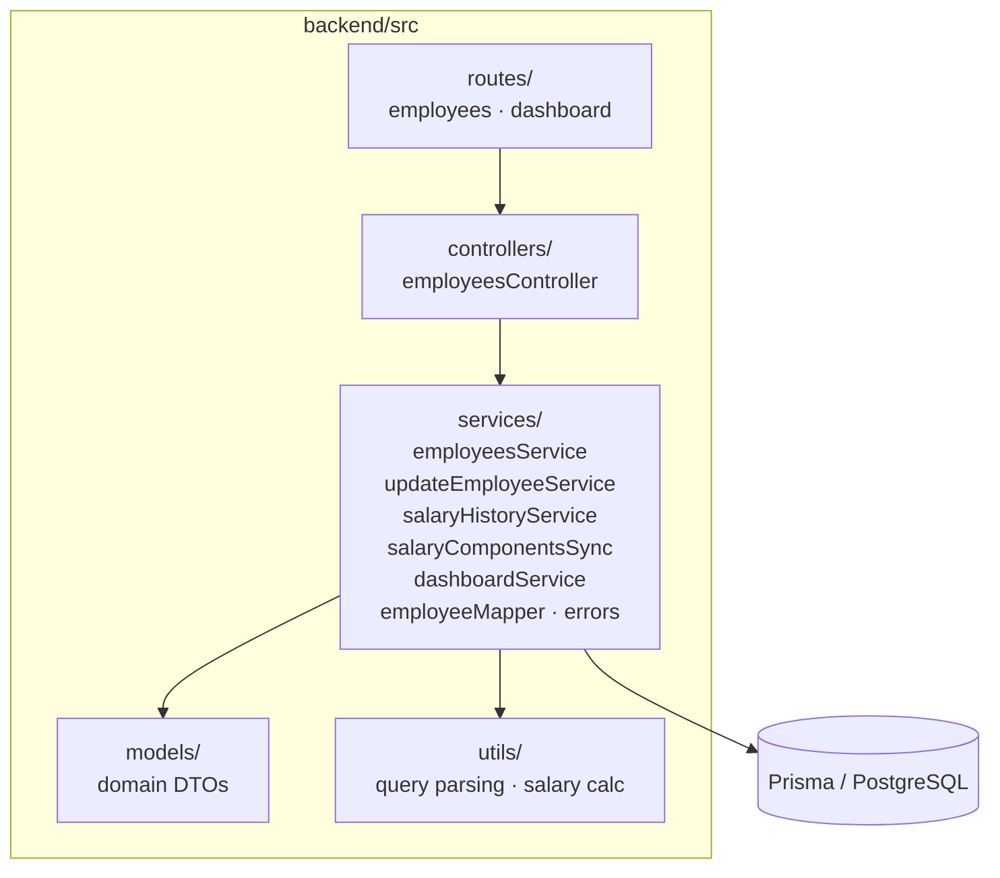
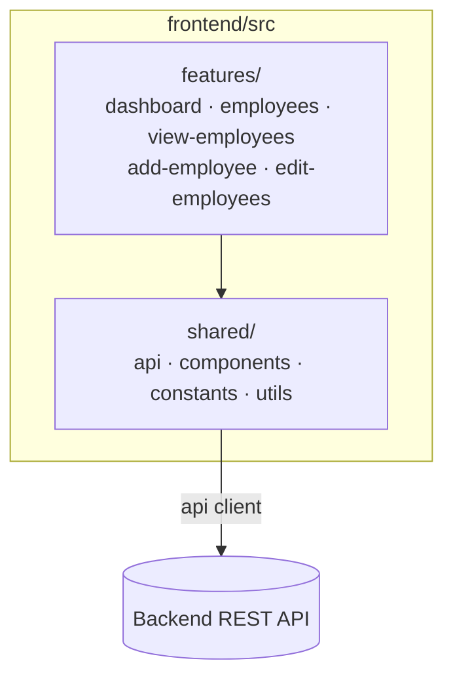
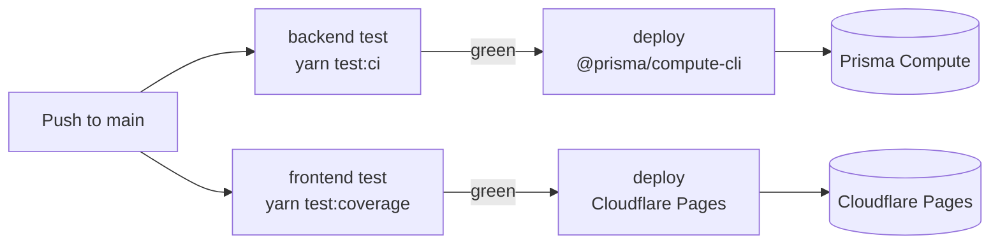

# Architecture

The system is a monorepo with two independent services: a **React frontend** and
an **Express backend**, backed by **PostgreSQL** via Prisma.

## High-Level Architecture

Frontend and backend run as separate services on separate ports. The frontend
calls the backend over REST under `/api/v1`; the backend reads/writes PostgreSQL
through Prisma.

## Backend

Layered Express app: **routes → controllers → services → Prisma**. Services map
Prisma rows to domain models (`src/models`) so ORM types never leak into the API.

- **routes/** — endpoint definitions mounted under `/api/v1`.
- **controllers/** — request/response handling and validation entry points.
- **services/** — business logic and all Prisma access.
- **models/** — application domain/DTO types.
- **utils/** — query-param parsing and salary calculations.

Schema and migrations live under `backend/prisma/`; the DB connection comes from
`DATABASE_URL`.

## Frontend

Feature-based structure. Each feature owns its pages/components; cross-cutting
code lives in `shared/`.

- **features/** — self-contained feature slices (pages + components + hooks).
- **shared/** — API client, reusable components, constants, and helpers.

## API Endpoints

| Method | Endpoint                               | Description                     |
| ------ | -------------------------------------- | ------------------------------- |
| GET    | `/api/v1/employees`                    | List (paginated/filter/sort)    |
| POST   | `/api/v1/employees`                    | Create an employee              |
| GET    | `/api/v1/employees/:id`                | Get one employee                |
| PUT    | `/api/v1/employees/:id`                | Update (incl. salary revision)  |
| GET    | `/api/v1/employees/:id/salary-history` | Salary revision history         |
| GET    | `/api/v1/dashboard`                    | Compensation dashboard analytics|

## Testing

- **Backend** — Jest + ts-jest (unit) and Supertest (API integration); typed
  fixtures under `test/data/`.
- **Frontend** — Vitest + React Testing Library (jsdom).

## CI/CD & Deployment

GitHub Actions in `.github/workflows/` deploy each service independently from
`main`. Every workflow runs a `test` job first and only deploys if it passes.

- **`deploy-backend.yml`** — on push to `main` touching `backend/**`. Runs
  `yarn test:ci`, builds with `tsc`, and deploys the compiled `dist/` artifact
  to **Prisma Compute** via `@prisma/compute-cli`.
- **`deploy-frontend.yml`** — on push to `main` touching `frontend/**`. Runs
  `yarn test:coverage`, builds with Vite, and deploys `dist/` to
  **Cloudflare Pages** via `wrangler-action`.

Deployment config is supplied via the GitHub `dev` environment:

| Service  | Secrets                                       | Variables                                                        |
| -------- | --------------------------------------------- | ---------------------------------------------------------------- |
| Backend  | `PRISMA_API_TOKEN`, `DATABASE_URL`            | `BACKEND_COMPUTE_SERVICE_ID`, `BACKEND_PORT`                     |
| Frontend | `CLOUDFLARE_API_TOKEN`, `CLOUDFLARE_ACCOUNT_ID` | `CLOUDFLARE_PAGES_PROJECT`, `VITE_API_BASE_URL`                |
