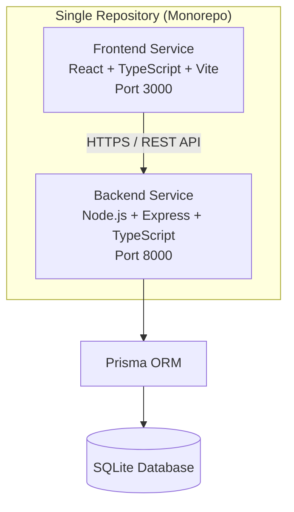

# Architecture

## High-Level Architecture

**Runtime model:** Frontend and backend run as separate services on separate ports, while sharing the same repository.

## Frontend

### Technology

* React
* TypeScript
* Vite
* Material UI
* React Query
* Recharts

### Responsibilities

* Employee management UI
* Salary management UI
* Dashboard visualizations
* Search and filtering

## Backend

### Technology

* Node.js
* Express
* TypeScript
* Prisma

### Responsibilities

* Employee APIs
* Salary APIs
* Dashboard APIs
* Salary history management
* Validation and business logic

## Database

### Employee

Stores employee profile information.

### Salary

Stores current compensation details.

### Salary Revision

Stores historical salary changes for auditability.

## Performance Considerations

* Database indexing on:

    * Employee ID
    * Department
    * Country
* Server-side pagination
* Optimized dashboard aggregation queries

## Testing Strategy

### Backend

* Service layer unit tests
* API integration tests

### Frontend

* Component tests
* User interaction tests

## Deployment

Frontend and backend can be deployed independently.

Suggested platforms:

* Frontend: Vercel
* Backend: Render / Railway
* Database: SQLite
