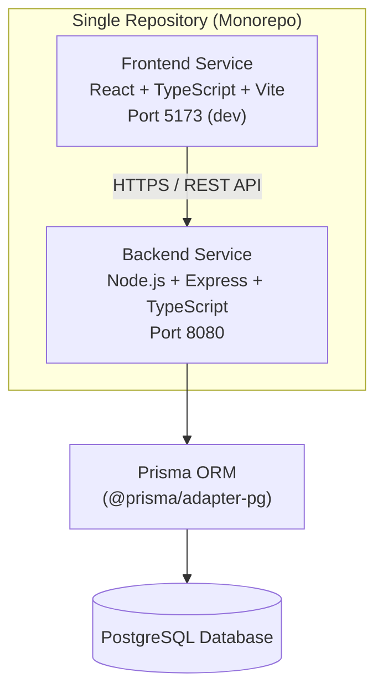
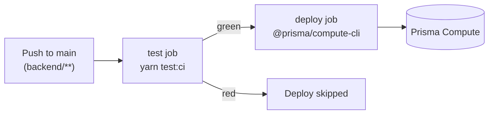

# Architecture

## High-Level Architecture

**Runtime model:** Frontend and backend run as separate services on separate ports, while sharing the same repository.

## Frontend

### Technology

* React
* TypeScript
* Vite
* Material UI
* React Query
* Recharts

### Responsibilities

* Employee management UI
* Salary management UI
* Dashboard visualizations
* Search and filtering

## Backend

### Technology

* Node.js
* Express 5
* TypeScript 6
* Prisma 7 ORM with the `@prisma/adapter-pg` PostgreSQL adapter

### Responsibilities

* Employee APIs (list with pagination/filtering/sorting, get by id) — *implemented*
* Salary APIs — *planned*
* Dashboard APIs (`GET /api/v1/dashboard`) — *implemented*
* Salary history management — *planned*
* Validation and business logic

### Dashboard API (implemented)

`GET /api/v1/dashboard` is implemented with:

* Query validation for `countryCode` and `limit`
* Backend currency conversion and conversion metadata (`rate`, `convertedAt`)
* Response sections: `summaryCards`, `recentPayrolls`, `meta`
* Data sourced from Prisma `Payroll` records

### Query parsing

Incoming HTTP query parameters are parsed and validated into a typed
`EmployeeQuery` (page, pageSize, sortBy, sortOrder, filters) before reaching
the service layer. Generic parsing helpers live in `src/utils/queryParams.ts`;
employee-specific validation lives in `src/services/employeeQuery.ts`. Invalid
input results in a `400` response.

### Domain models

The service layer maps Prisma rows to application domain models defined in
`src/models` (e.g. `Employee`, `EmployeeQuery`, `PaginatedResult<T>`) rather
than exposing ORM-generated types as the public contract.

## Database

PostgreSQL, accessed through Prisma using the `@prisma/adapter-pg` driver
adapter. The connection string is supplied via the `DATABASE_URL` environment
variable. Schema and migrations live under `backend/prisma/`.

## Performance Considerations

* Database indexing on:

    * Employee ID
    * Department
    * Country
* Server-side pagination
* Optimized dashboard aggregation queries

## Testing Strategy

### Backend

* Service layer unit tests (Jest + ts-jest)
* API integration tests (Supertest)
* Coverage collected via Jest (`text`, `lcov`, `html`, `json-summary`) and a
  JUnit report (`jest-junit`) for CI integrations
* Typed fixtures under `test/data/` validated against domain types

### Frontend

* Component/page tests (Vitest + Testing Library)
* Hook/service tests for dashboard data flow
* Mock service contract tests for dashboard API stub

## CI/CD

GitHub Actions workflows in `.github/workflows/`:

* **`tests-backend.yml`** — runs on pushes/PRs touching `backend/**`; installs
  dependencies, runs `yarn test:ci`, publishes a coverage summary to the job
  summary, and uploads the coverage report as an artifact.
* **`deploy-backend.yml`** — runs on pushes to `main` touching `backend/**`
  (or manual dispatch). A `test` job runs the suite first, and the `deploy`
  job (`needs: test`) only runs if tests pass.

## Deployment

The backend is deployed to **Prisma Compute** using the
[`@prisma/compute-cli`](https://www.npmjs.com/package/@prisma/compute-cli) in
pre-built (skip-build) mode: the workflow builds with `tsc`, then deploys the
compiled `dist/` artifact with `src/main.js` as the entrypoint.

Deployment configuration is supplied through the GitHub `dev` environment:

| Type | Name | Description |
|------|------|-------------|
| Secret | `PRISMA_API_TOKEN` | Prisma API service token |
| Secret | `DATABASE_URL` | Runtime PostgreSQL connection string |
| Variable | `COMPUTE_SERVICE_ID` | Target Prisma Compute service ID |
| Variable | `PORT` | HTTP port the service listens on |

Frontend and backend can be deployed independently. Suggested frontend
platform: Vercel.
