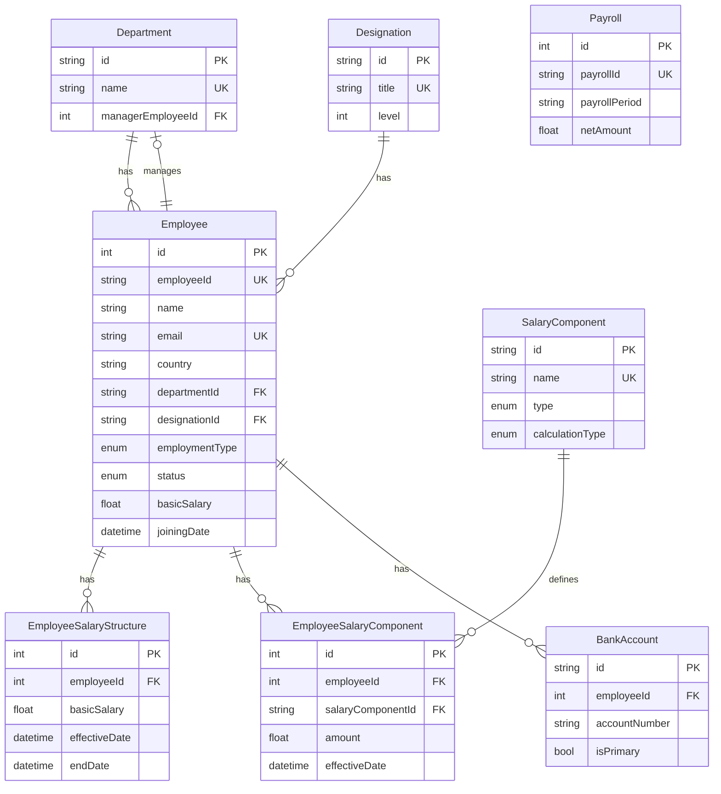

# Database Schema

PostgreSQL schema managed by Prisma. Source of truth: the `.prisma` files under
[`backend/prisma/schema/`](../../backend/prisma/schema/).

## ER Diagram

> `Payroll` holds aggregate monthly totals and is not linked to individual
> employees; it powers the dashboard analytics.

## Models

### Employee (`employee`)

Core employee record with organizational and base-compensation info.

| Field                          | Type           | Notes                                   |
| ------------------------------ | -------------- | --------------------------------------- |
| `id`                           | Int            | PK, autoincrement                       |
| `employeeId`                   | String         | Unique (e.g. `EMP-001`)                 |
| `name`, `email`                | String         | `email` unique                          |
| `phoneNumber`, `dateOfBirth`   | String?, Date? | Optional                                |
| `gender`                       | Gender?        | `MALE`/`FEMALE`/`OTHER`                  |
| `country`                      | String         | Location / tax jurisdiction             |
| `departmentId`                 | String         | FK → Department                         |
| `designationId`                | String         | FK → Designation                        |
| `employmentType`               | EmploymentType | Default `PERMANENT`                     |
| `joiningDate`                  | DateTime       |                                         |
| `status`                       | EmployeeStatus | Default `ACTIVE`                        |
| `basicSalary`, `currency`      | Float, String  | `currency` default `INR`                |
| `createdAt`, `updatedAt`       | DateTime       | Managed by Prisma                       |

Relations: many `EmployeeSalaryStructure`, `EmployeeSalaryComponent`,
`BankAccount`; may manage `Department` (`DepartmentManager`).

### Department (`department`)

| Field               | Type    | Notes                        |
| ------------------- | ------- | ---------------------------- |
| `id`                | String  | PK (cuid)                    |
| `name`              | String  | Unique                       |
| `description`       | String? | Optional                     |
| `managerEmployeeId` | Int?    | FK → Employee (`SetNull`)    |

### Designation (`designation`)

| Field         | Type    | Notes      |
| ------------- | ------- | ---------- |
| `id`          | String  | PK (cuid)  |
| `title`       | String  | Unique     |
| `description` | String? | Optional   |
| `level`       | Int?    | Optional   |

### EmployeeSalaryStructure (`employee_salary_structure`)

Base salary with effective dates per employee.

| Field           | Type      | Notes                     |
| --------------- | --------- | ------------------------- |
| `id`            | Int       | PK, autoincrement         |
| `employeeId`    | Int       | FK → Employee (`Cascade`) |
| `basicSalary`   | Float     |                           |
| `effectiveDate` | DateTime  |                           |
| `endDate`       | DateTime? | Null = current            |
| `currency`      | String    | Default `INR`             |

### SalaryComponent (`salary_component`)

Catalog of components (HRA, DA, tax, etc.).

| Field             | Type            | Notes                                    |
| ----------------- | --------------- | ---------------------------------------- |
| `id`              | String          | PK (cuid)                                |
| `name`            | String          | Unique                                   |
| `type`            | ComponentType   | `EARNING`/`ALLOWANCE`/`DEDUCTION`/`TAX`  |
| `calculationType` | CalculationType | `FIXED`/`PERCENTAGE`/`FORMULA`           |
| `displayOrder`    | Int             | Default `0`                              |
| `isActive`        | Boolean         | Default `true`                           |

### EmployeeSalaryComponent (`employee_salary_component`)

Per-employee component values. Unique on
`(employeeId, salaryComponentId, effectiveDate)`.

| Field               | Type      | Notes                            |
| ------------------- | --------- | -------------------------------- |
| `id`                | Int       | PK, autoincrement                |
| `employeeId`        | Int       | FK → Employee (`Cascade`)        |
| `salaryComponentId` | String    | FK → SalaryComponent (`Cascade`) |
| `amount`            | Float     |                                  |
| `effectiveDate`     | DateTime  |                                  |
| `endDate`           | DateTime? | Null = current                   |
| `remarks`           | String?   | Optional                         |

### BankAccount (`bank_account`)

| Field                                | Type        | Notes                     |
| ------------------------------------ | ----------- | ------------------------- |
| `id`                                 | String      | PK (cuid)                 |
| `employeeId`                         | Int         | FK → Employee (`Cascade`) |
| `bankName`, `accountNumber`, `ifscCode`, `accountHolderName` | String | |
| `accountType`                        | AccountType | `SAVINGS`/`CURRENT`/`NRI` |
| `isPrimary`, `isActive`              | Boolean     | Default `true`            |

### Payroll (`payroll`)

Aggregate monthly payroll totals (not tied to individual employees).

| Field                          | Type     | Notes                    |
| ------------------------------ | -------- | ------------------------ |
| `id`                           | Int      | PK, autoincrement        |
| `payrollId`                    | String   | Unique                   |
| `payrollPeriod`                | String   | e.g. `2026-06`           |
| `payoutDate`                   | DateTime |                          |
| `status`                       | String   | Default `Completed`      |
| `totalAmount`, `totalDeductions`, `netAmount` | Float | |
| `currency`, `country`          | String   | Defaults `INR` / `IN`    |

## Enums

| Enum              | Values                                          |
| ----------------- | ----------------------------------------------- |
| `EmployeeStatus`  | `ACTIVE`, `INACTIVE`, `ON_LEAVE`, `TERMINATED`  |
| `EmploymentType`  | `PERMANENT`, `CONTRACT`, `TEMPORARY`, `INTERN`  |
| `Gender`          | `MALE`, `FEMALE`, `OTHER`                        |
| `ComponentType`   | `EARNING`, `ALLOWANCE`, `DEDUCTION`, `TAX`       |
| `CalculationType` | `FIXED`, `PERCENTAGE`, `FORMULA`                 |
| `AccountType`     | `SAVINGS`, `CURRENT`, `NRI`                       |
