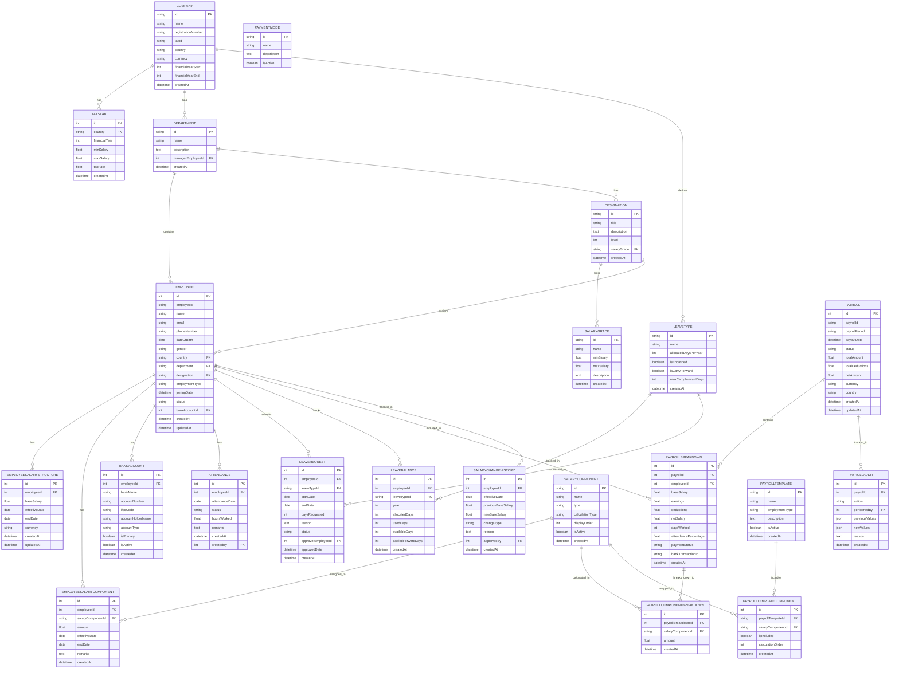

# Salary Management Portal - Entity Relationship Diagram



---

## Diagram Legend

**Relationships:**
- `||--o{` = One-to-Many (One entity relates to many other entities)
- `||--||` = One-to-One (One entity relates to exactly one other entity)
- `o{` = Many (multiple records)
- `||` = One (single record)

**Example:**
- `COMPANY ||--o{ DEPARTMENT : has` = One company has many departments
- `EMPLOYEE ||--o{ PAYROLLBREAKDOWN : included_in` = One employee included in many payroll breakdowns
- `PAYROLL ||--o{ PAYROLLBREAKDOWN : contains` = One payroll contains many payroll breakdowns

---

## Data Flow Example

### Monthly Payroll Processing Flow

```
1. Company setup (COMPANY, DEPARTMENT, DESIGNATION, SALARYGRADE, TAXSLAB)
                ↓
2. Hire Employee (EMPLOYEE with BANKACCOUNT)
                ↓
3. Setup Salary (EMPLOYEESALARYSTRUCTURE, EMPLOYEESALARYCOMPONENT)
                ↓
4. Track Attendance (ATTENDANCE)
                ↓
5. Mark Leaves (LEAVEREQUEST → LEAVEBALANCE updates)
                ↓
6. Generate Payroll (PAYROLL → PAYROLLBREAKDOWN)
                ↓
7. Calculate Components (PAYROLLCOMPONENTBREAKDOWN)
                ↓
8. Audit & Payment (PAYROLLAUDIT → BANKACCOUNT payment via PAYMENTMODE)
                ↓
9. Employee Payslip (from PAYROLLBREAKDOWN + PAYROLLCOMPONENTBREAKDOWN)
```

---

## Key Table Clusters

### Cluster 1: Organizational Setup
```
COMPANY
├── DEPARTMENT
├── DESIGNATION
├── SALARYGRADE
└── LEAVETYPE
```

### Cluster 2: Employee Management
```
EMPLOYEE (core)
├── EMPLOYEESALARYSTRUCTURE
├── EMPLOYEESALARYCOMPONENT
├── BANKACCOUNT
├── ATTENDANCE
├── LEAVEBALANCE
└── LEAVEREQUEST
```

### Cluster 3: Salary Calculation
```
SALARYCOMPONENT
├── EMPLOYEESALARYCOMPONENT
├── PAYROLLCOMPONENTBREAKDOWN
└── PAYROLLTEMPLATECOMPONENT
```

### Cluster 4: Payroll Processing
```
PAYROLL (monthly aggregate)
├── PAYROLLBREAKDOWN (per employee)
│   └── PAYROLLCOMPONENTBREAKDOWN (per component)
├── PAYROLLAUDIT (change tracking)
└── TAXSLAB (tax calculation)
```

### Cluster 5: History & Audit
```
PAYROLLAUDIT
└── SALARYCHANGEHISTORY
```

---

## Query Examples

**Get Employee Payslip:**
```sql
SELECT 
  e.employeeId,
  e.name,
  pb.baseSalary,
  pcb.salaryComponentId,
  pcb.amount,
  pb.netSalary
FROM PAYROLLBREAKDOWN pb
JOIN EMPLOYEE e ON pb.employeeId = e.id
JOIN PAYROLLCOMPONENTBREAKDOWN pcb ON pb.id = pcb.payrollBreakdownId
WHERE pb.payrollId = 'PAY-2026-06' AND e.employeeId = 'EMP-001'
```

**Get Employee Leave Balance:**
```sql
SELECT 
  e.name,
  lt.name as leaveType,
  lb.allocatedDays,
  lb.usedDays,
  lb.availableDays
FROM LEAVEBALANCE lb
JOIN EMPLOYEE e ON lb.employeeId = e.id
JOIN LEAVETYPE lt ON lb.leaveTypeId = lt.id
WHERE lb.year = 2026 AND e.employeeId = 'EMP-001'
```

**Get Total Monthly Payroll:**
```sql
SELECT 
  p.payrollId,
  p.payrollPeriod,
  SUM(pb.baseSalary) as totalBaseSalary,
  SUM(pb.earnings) as totalEarnings,
  SUM(pb.deductions) as totalDeductions,
  SUM(pb.netSalary) as totalNetSalary
FROM PAYROLL p
JOIN PAYROLLBREAKDOWN pb ON p.id = pb.payrollId
GROUP BY p.id, p.payrollId, p.payrollPeriod
```

**Get Attendance Summary:**
```sql
SELECT 
  e.name,
  COUNT(*) as totalDays,
  SUM(CASE WHEN a.status = 'PRESENT' THEN 1 ELSE 0 END) as presentDays,
  (SUM(CASE WHEN a.status = 'PRESENT' THEN 1 ELSE 0 END) * 100.0 / COUNT(*)) as attendancePercentage
FROM ATTENDANCE a
JOIN EMPLOYEE e ON a.employeeId = e.id
WHERE MONTH(a.attendanceDate) = 6 AND YEAR(a.attendanceDate) = 2026
GROUP BY e.id, e.name
```
