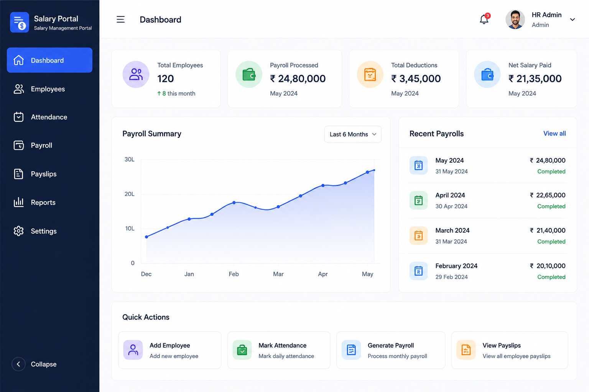

# Dashboard Dummy Data via API Stub

- **Date**: 2026-06-27
- **Status**: draft
- **Author**: BA Planner
- **Persona**: HR Manager

## User Story
As an HR Manager, I want the dashboard to display meaningful values using temporary API-sourced dummy data so that the page feels usable and realistic while backend endpoints are still in progress.

## Background / Context
The previous story established the Home dashboard layout and empty section scaffolding. This follow-up story introduces temporary populated content for selected widgets, but keeps the integration pattern aligned with future backend work: the UI must consume data through an API-style service contract rather than hardcoded inline values in components.

This story is intended as a bridge step until backend APIs are ready. Once real APIs are available, the temporary dummy response can be swapped without reworking dashboard presentation logic.

Related prior story:
- Home page layout and empty scaffolding: [2026-06-27-home-page-layout.md](2026-06-27-home-page-layout.md)

## Scope
### In Scope
- Populate dashboard values for selected areas only:
  - Top summary stat cards
  - Payroll Summary section
- Use a frontend-local mock API module/service that returns asynchronous dummy data (Promise-based).
- Fetch data once on initial dashboard load.
- Add dashboard states for:
  - Loading
  - Error
  - Retry from error state
  - Successful data render
- Ensure UI components receive data from the API service response shape, not from hardcoded constants inside rendering components.
- Keep this behavior clearly temporary and replaceable when backend API is delivered.

### Out of Scope
- Real backend API integration.
- Data population for Recent Payrolls and Quick Actions in this story.
- Auto-refresh behavior.
- Manual refresh control in normal success state.
- Navigation/routing changes.
- Any redesign of the existing dashboard shell.

## Brainstorm Notes
- Assumptions:
  - Existing dashboard layout from prior story remains unchanged.
  - Dummy data values should look realistic for HR usage but do not need to match production totals.
  - Dummy values remain fixed/static across sessions until backend integration replaces the mock source.
  - Payroll amount formatting follows INR locale conventions (`en-IN`).
  - API contract naming should be stable enough to minimize future refactors when backend is ready.
  - Retry is only required for error recovery after failed fetch.
- Dependencies:
  - Existing dashboard page and widget placeholders from prior story.
  - Frontend data-fetch orchestration approach already used in the project (or lightweight equivalent for this temporary step).
- Edge cases:
  - Partial payloads: missing fields should degrade gracefully (fallback display, no crashes).
  - Slow response: loading state must be visible and not cause layout shift.
  - Failed response: clear error message and working retry action.
  - Numeric formatting consistency for currency/count values.

## Acceptance Criteria
- [ ] Given the dashboard page loads, when initial data fetch starts, then a visible loading state is shown for summary cards and payroll summary widgets.
- [ ] Given the mock API service returns data successfully, when loading completes, then summary cards and payroll summary display populated dummy values.
- [ ] Given the mock API service fails, when the page handles the failure, then an error state is shown with a retry action.
- [ ] Given the dashboard is in error state, when the user triggers retry, then the app attempts the fetch again and transitions to success when data is returned.
- [ ] Given dashboard widgets render populated values, when implementation is reviewed, then values are sourced from API response data flow and not hardcoded in UI component markup.
- [ ] Given this is a temporary bridge, when backend API becomes available, then the system can replace only the mock API implementation without redesigning widget presentation contracts.
- [ ] Given this story scope, when the page is rendered, then only summary cards and payroll summary are populated, while other sections remain unchanged from prior story.
- [ ] Given dashboard data is fetched, when page initializes, then fetch happens once on load with no auto-refresh.

## Screenshots / Mockups
- [2026-06-27-home-page-dashboard.png](../assets/2026-06-27-home-page-dashboard.png)

Preview: Home page (Dashboard) reference design

## Open Questions / Assumptions
- Resolved: Dummy values are fixed/static for all users and sessions in this temporary phase.
- Resolved: Currency and locale formatting is INR with `en-IN` conventions.
- Resolved: Error and retry text is deferred to implementation team standards (no fixed copy in this story).
- Resolved: Recent Payrolls and Quick Actions remain deferred and unpopulated in this story.
