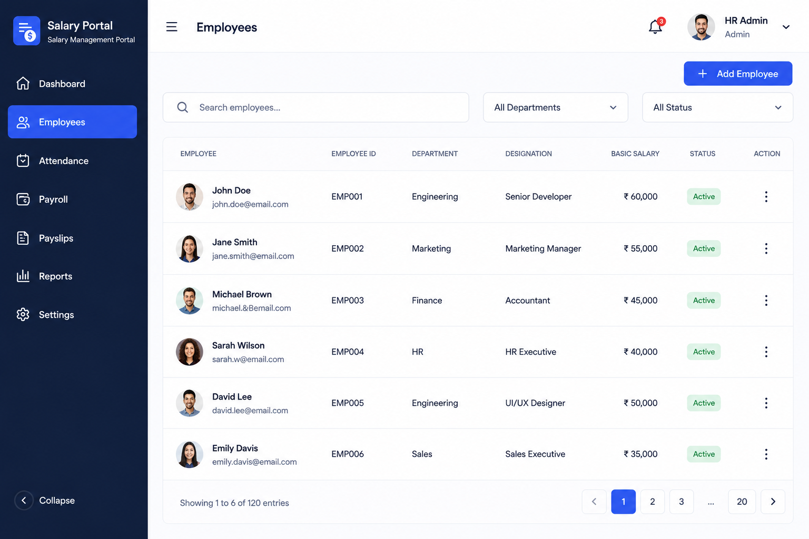

# Employees Tab - List View

- **Date**: 2026-06-28
- **Status**: draft
- **Author**: BA Planner
- **Persona**: HR Manager

## User Story
As an HR Manager, I want to view and interact with an employee list (search, filter, paginate, and access row actions) so that I can quickly find people and prepare employee operations once backend APIs are available.

## Background / Context
The Employees tab UI has been designed and should be finalized as a functional list-view experience aligned to the provided mockup. The immediate need is to wire the frontend behavior so controls and table interactions are ready for backend integration, even though the final APIs are not yet available. This reduces integration lead time and allows the UI to work out of the box once the API is delivered.

## Scope
### In Scope
- Employees list page with table-based layout matching the provided design.
- Search input wiring for employee lookup behavior.
- Department filter wiring.
- Status filter wiring.
- Pagination wiring and visible pagination controls.
- Add Employee CTA visible on page and opens placeholder modal/toast.
- Row action menu with stub actions (Edit/View) without backend execution.
- API response contract for employee list retrieval attached in this story.
- Responsive behavior for desktop and tablet.

### Out of Scope
- Add Employee form/workflow implementation.
- Row action backend execution (Edit/View server operations).
- Delete/status-change row actions.
- Backend API implementation.
- Role/permission redesign.
- Mobile-specific layout optimization.

## Brainstorm Notes
- Assumptions:
  - Frontend control wiring should be implemented now against a contract-first approach.
  - Until APIs are ready, the page may use mocked/stubbed data sources that mirror the contract shape.
  - Currency and converted salary value are provided by backend based on requested targetCurrencyCode.
  - Employee status defaults to Active in initial sample/mock states unless otherwise provided.
- Dependencies:
  - Backend endpoint availability for employee list retrieval.
  - Consistent department and status enumerations between frontend and backend.
  - Shared pagination model (page, pageSize, totalRecords, totalPages).
- Edge cases:
  - Empty results after search/filter should show a no-data state.
  - Invalid/expired filter values should fail gracefully and reset to default options.
  - Large datasets should preserve stable pagination behavior.
  - API/network errors should present a recoverable error state without breaking page shell.

## API Response Contract (Attached to Story Card)
### Endpoint
- **Method**: GET
- **Path**: `/api/v1/employees`

### Query Parameters
- `search` (string, optional): Search by name, email, or employeeId.
- `department` (string, optional): Department filter enum value (`ENGINEERING`, `MARKETING`, `FINANCE`, `HR`, `SALES`).
- `status` (string, optional): Employment status filter enum value (`ACTIVE`, `INACTIVE`, `ON_LEAVE`, `TERMINATED`).
- `targetCurrencyCode` (string, optional): Target currency code used by backend to return converted salary values.
- `page` (number, optional, default: `1`): 1-based page index.
- `pageLimit` (number, optional, default: `10`): Page size.

### Enum Definitions
- `department`: `ENGINEERING`, `MARKETING`, `FINANCE`, `HR`, `SALES`
- `designation`: `SENIOR_DEVELOPER`, `MARKETING_MANAGER`, `ACCOUNTANT`, `HR_EXECUTIVE`, `UI_UX_DESIGNER`, `SALES_EXECUTIVE`
- `status`: `ACTIVE`, `INACTIVE`, `ON_LEAVE`, `TERMINATED`

### Success Response (200)
```json
{
  "data": [
    {
      "employeeId": "EMP001",
      "fullName": "John Doe",
      "email": "john.doe@email.com",
      "department": "ENGINEERING",
      "designation": "SENIOR_DEVELOPER",
      "basicSalary": 60000,
      "currency": "INR",
      "status": "ACTIVE",
      "avatarUrl": "https://example.com/avatars/emp001.png"
    }
  ],
  "meta": {
    "page": 1,
    "pageLimit": 10,
    "totalRecords": 120,
    "totalPages": 12,
    "hasNextPage": true,
    "hasPreviousPage": false,
    "currency": "INR",
    "targetCurrency": "INR",
    "conversion": {
      "rate": 1,
      "convertedAt": "2026-06-28T06:16:21.694Z"
    }
  },
  "filters": {
    "applied": {
      "search": "",
      "department": "",
      "status": ""
    }
  }
}
```

### Error Responses
- `400 Bad Request`: Invalid query parameter values (e.g., negative page).
- `401 Unauthorized`: Authentication missing/invalid.
- `403 Forbidden`: User lacks permission to view employees.
- `500 Internal Server Error`: Unexpected server failure.

### Contract Notes
- Salary is numeric in API and formatted for display in UI.
- Salary value is already converted by backend for the requested `targetCurrencyCode`.
- Department, designation, and status are returned as canonical enum codes.
- UI maps enum codes to human-readable labels (and localization where needed).
- Enum-backed fields should be defined in Prisma schema as enums (for example, `EmployeeStatus`, `Department`) and returned as enum codes in API payloads.
- If `designation` needs frequent business-driven changes, keep it as a String/lookup-backed value in Prisma instead of a hard enum.
- Unknown or missing optional fields (e.g., `avatarUrl`) should fall back to safe UI defaults.

## Acceptance Criteria
- [ ] Given the HR Manager opens Employees tab, when the page loads, then the employee table is displayed with columns for employee details, employee ID, department, designation, basic salary, status, and actions.
- [ ] Given the user enters a search term, when search is submitted or debounced, then the list request is issued with `search` and results reflect matching employees.
- [ ] Given the user selects a department, when filter is applied, then the list request includes `department` and results match that department.
- [ ] Given the user selects a status, when filter is applied, then the list request includes `status` and results match that status.
- [ ] Given the user changes page, when pagination control is used, then the list request includes `page` and `pageLimit` and table updates accordingly.
- [ ] Given Add Employee CTA is shown, when clicked, then a placeholder modal/toast is displayed and no full creation flow is required in this story.
- [ ] Given row action menu icon is shown for each employee, when clicked, then stub actions (`Edit`, `View`) are visible and navigational/backend execution is deferred.
- [ ] Given backend APIs are not yet available, when frontend wiring is delivered, then integration can work without UI contract changes once endpoint follows the defined response contract.
- [ ] Given desktop and tablet viewports, when the page is rendered, then layout remains usable and visually aligned with the provided mockup.

## Screenshots / Mockups
- [2026-06-27-employee-tab.png](../assets/2026-06-27-employee-tab.png)

<details>
<summary>Preview: Employees tab mockup with search, filters, and employee table</summary>



</details>

## Open Questions / Assumptions
- Confirmed: Add Employee CTA opens a placeholder modal/toast in this story.
- Confirmed: Search triggers on debounced typing (300 ms).
- Confirmed: Mobile is out of scope; desktop + tablet only.
- Confirmed: Row action menu includes stub `Edit` and `View` actions without backend execution.
- Confirmed: Backend supports targetCurrencyCode parameter and returns converted salary values plus `meta.conversion` details.
