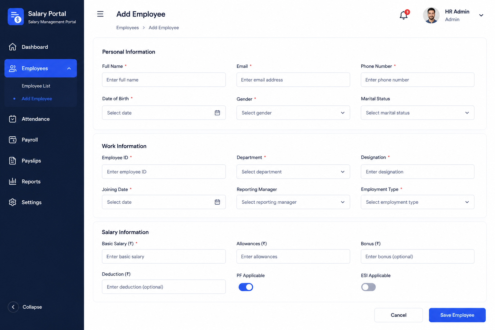

# Add Employee Create API

- **Date**: 2026-06-29
- **Status**: draft
- **Author**: BA Planner
- **Persona**: HR Manager

## User Story
As an HR Manager, I want the system to provide a Create Employee API so that submitted employee form data can be persisted reliably and used to open the new employee record.

## Background / Context
The Add Employee UI flow requires a backend create endpoint that accepts the same field set shown in the Add Employee form and returns a successful creation response for downstream navigation and employee record visibility. This story defines the API contract, validation expectations, and integration behavior for create-employee requests.

## Scope
### In Scope
- Define a REST JSON Create Employee API contract.
- Define request payload fields aligned to the Add Employee form.
- Define required/optional fields, validation rules, and error responses.
- Define duplicate handling policy for employee ID uniqueness.
- Define success response shape (full created employee object).
- Include implementation tasks for backend/API integration.

### Out of Scope
- Employee edit/update APIs.
- Bulk upload/import APIs.
- Authentication/authorization redesign.
- Department master/lookup APIs beyond usage assumptions.
- UI redesign of Add Employee page.

## Brainstorm Notes
- Assumptions: API style is REST JSON. Endpoint path will follow existing backend convention (TBD during implementation). Employee ID uniqueness is the only duplicate-blocking rule in this story. Success returns full created employee object. Validation emphasis is API contract and status-code behavior.
- Dependencies: Existing backend routing conventions, persistence layer support for employee fields, and unique constraint/check for employee ID.
- Edge cases: Missing required fields, invalid date values, invalid email/phone, negative salary values, duplicate employee ID, malformed request body, server failure during create.

## Acceptance Criteria
- [ ] Given a valid Add Employee payload, when the client sends a create request, then the API creates a new employee record and returns a success response with the full created employee object.
- [ ] Given required fields are missing, when a create request is submitted, then the API returns validation errors with a client-error status and field-level details.
- [ ] Given invalid field formats (email, phone, dates, salary values), when a create request is submitted, then the API rejects the request with structured validation feedback.
- [ ] Given an existing employee ID is submitted, when a create request is made, then the API rejects creation and returns a duplicate employee ID error contract.
- [ ] Given optional salary fields are omitted, when a valid create request is submitted, then the API accepts the request and persists defaults/null-safe values per contract.
- [ ] Given backend create succeeds, when response is returned, then it includes a stable identifier and the created object fields required by downstream UI flow.
- [ ] Given an unexpected backend failure occurs, when create is attempted, then the API returns a server-error response with a non-sensitive error message contract.
- [ ] Given implementation begins, when engineering executes this story, then tasks include endpoint wiring, request validation, duplicate check, persistence mapping, and automated tests for success/failure scenarios.

## Screenshots / Mockups
- [2026-06-28-add-employee.png](../assets/2026-06-28-add-employee.png)

Preview: Add Employee form field reference for Create Employee API payload mapping

## Open Questions / Assumptions
- Assumption: Endpoint URL path will follow existing backend convention and be finalized during implementation (for example `/api/employees` or equivalent).
- Assumption: Duplicate blocking is required for employee ID only; email/phone uniqueness is not required in this story.
- Open question: Should the successful create response include system metadata fields (for example `createdAt`, `updatedAt`) or only domain fields required by UI?
- Open question: Should validation error response use one standardized envelope shape shared across all backend APIs?
