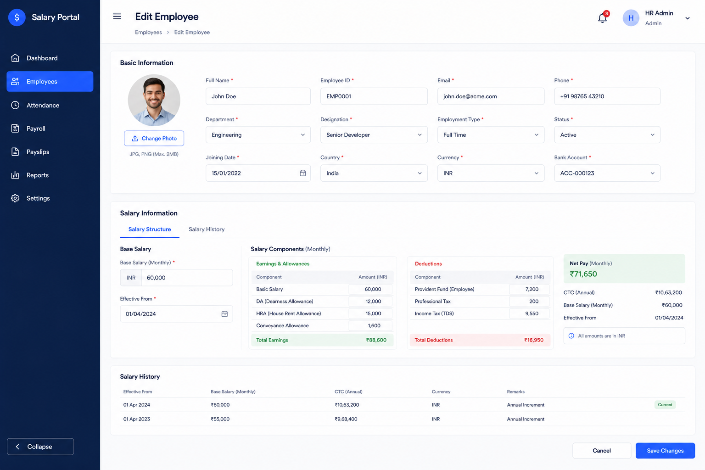

# Edit Employee UI

- **Date**: 2026-06-29
- **Status**: draft
- **Author**: BA Planner
- **Persona**: HR Manager

## User Story

As an HR Manager, I want to edit an existing employee's basic information and salary structure through a pre-populated form so that I can keep employee records accurate without re-entering all details from scratch.

## Background / Context

A companion backend API (`PUT /api/v1/employees/:id`) is specified in
[docs/story/2026-06-29-update-employee-details-api.md](./2026-06-29-update-employee-details-api.md).
This UI story covers the frontend surface: the Edit Employee page, its form fields, validation,
loading states, and navigation flow. The form mirrors the two-tab layout already used on the
Add Employee page, pre-populated with the employee's current values fetched from the API.

## Scope

### In Scope

- **Edit Employee page** (`/employees/:id/edit`) — full-page route, not a modal
- **Entry points** — "Edit" button on the Employee Details page AND an action on the Employees list table row
- **Two-tab form** reusing the existing Add Employee tab structure:
  - **Tab 1 — Basic Information**: Full Name, Employee ID (read-only), Email, Phone, Department, Designation, Employment Type, Status, Joining Date, Country, Currency, Bank Account
  - **Tab 2 — Salary Structure**: Base Monthly Salary, Effective From
- **Pre-population** — all editable fields filled with current employee values on mount
- **Loading skeleton** while employee data is being fetched
- **Inline field validation** — shown on blur and on submit attempt
- **Save action** — calls `PUT /api/v1/employees/:id`, redirects to Employee Details page on success, shows a success toast notification
- **Cancel action** — silently discards changes and navigates back (no confirmation dialog)
- **Error handling** — API error responses surfaced as form-level or field-level messages

### Out of Scope

- Profile photo upload (separate story / endpoint)
- `employeeId` field editing — displayed read-only
- Optimistic locking / version conflict detection
- Role-based access control / hiding the Edit button by role (separate story)
- Bulk edit
- Mobile / responsive layout (desktop-only for this story)

## Brainstorm Notes

### Assumptions

- The route is `/employees/:id/edit`; navigating here directly (deep link) must still load and pre-populate correctly.
- The "Edit" button on the Employee Details page is placed in the header actions area (alongside existing buttons).
- The "Edit" action on the Employees list is an icon button in the row actions column (same column as the existing "View" action).
- `employeeId` (e.g. `EMP0001`) is rendered as a disabled/read-only field in the Basic Information tab — visually consistent with other fields but not editable.
- The Department and Designation dropdowns are populated from the same lookup API used by Add Employee.
- The Bank Account dropdown is populated from the BankAccount lookup API.
- Tab navigation is preserved: the user can switch between tabs freely before saving; validation is triggered for all fields on the final Save click, not per-tab.
- Salary components breakdown (DA, HRA, PF, etc.) is shown as a computed read-only preview in Tab 2 after the form is saved or when the page loads (same as the existing salary breakdown on the Details page); it is NOT user-editable.
- The success toast appears on the Employee Details page after redirect, not on the edit page.
- A loading error state (failed to fetch employee) shows a friendly error message with a "Go back" link.

### Dependencies

- `PUT /api/v1/employees/:id` backend endpoint (see companion story)
- `GET /api/v1/employees/:id` endpoint for pre-population
- Department, Designation, and BankAccount lookup API endpoints
- Existing design tokens, MUI theme, and component library
- Existing `AddEmployeePage` components (reuse / extend, do not duplicate)
- React Router v6 (`useParams`, `useNavigate`)
- Toast/snackbar notification component (existing or new)

### Edge Cases

- Employee not found (404 from GET) → show "Employee not found" error page/state.
- Network failure during initial load → show error state with retry option.
- API validation error (400) on Save → map field-level errors from the response to the relevant form fields.
- API conflict error (409 — e.g. duplicate email) → show inline error on the Email field.
- `effectiveFrom` earlier than `joiningDate` → client-side validation before API call.
- User navigates away via browser back button with unsaved changes → silently discard (no prompt).
- Department / Designation dropdown fails to load → show inline error in the dropdown; block Save with a validation message.
- Save button double-click → disable the button after first click while the request is in-flight.

## Acceptance Criteria

- [ ] Given the HR Manager is on the **Employee Details page**, when they click the **Edit** button in the header, then they are navigated to `/employees/:id/edit`.
- [ ] Given the HR Manager is on the **Employees list page**, when they click the **Edit** action in a table row, then they are navigated to `/employees/:id/edit`.
- [ ] Given the Edit page is loading employee data, then a **loading skeleton** matching the two-tab form layout is displayed.
- [ ] Given data has loaded, then all editable fields are **pre-populated** with the employee's current values.
- [ ] Given `employeeId` is visible in the Basic Information tab, then it is rendered as a **read-only** field that cannot be edited.
- [ ] Given the user clears a required field and blurs away, then an **inline validation error** appears below that field immediately.
- [ ] Given the user clicks Save with invalid fields, then all validation errors are shown **inline** and the API call is not made.
- [ ] Given `salary.effectiveFrom` is set earlier than the employee's `joiningDate`, then a **client-side validation error** is shown on the Effective From field before the API is called.
- [ ] Given the user clicks **Save** with a valid form, then the `PUT /api/v1/employees/:id` API is called with the full payload, the Save button is disabled while in-flight, and on success the user is **redirected to the Employee Details page** with a **success toast** notification.
- [ ] Given the API returns a **400 error** with field-level details, then the relevant fields show the server-provided error messages inline.
- [ ] Given the API returns a **409 conflict** (e.g. duplicate email), then the Email field shows an inline conflict error.
- [ ] Given the API returns any **5xx error**, then a generic form-level error banner is shown and the user can retry.
- [ ] Given the user clicks **Cancel**, then changes are silently discarded and the user is navigated back to the Employee Details page.
- [ ] Given the employee ID in the URL does not exist (404), then the page shows a **"Employee not found"** message with a link back to the Employees list.

## Screenshots / Mockups

- [2026-06-29-edit-employee-page.png](../assets/2026-06-29-edit-employee-page.png)

Preview: Edit Employee page — two-tab form with Basic Information and Salary Structure

## Open Questions

_All open questions resolved as of 2026-06-29._

| Question | Resolution |
|----------|------------|
| Entry point(s) | **Both** — Employee Details page header button AND Employees list row action |
| Form layout | **Two-tab layout** (same as Add Employee), pre-populated with current values |
| Cancel behaviour | **Silently discard** and navigate back — no confirmation dialog |
| Success behaviour | **Redirect to Employee Details page** with a success toast |
| Validation display | **Inline below each field**, shown on blur and on submit attempt |
| Loading state | **Show skeleton** while employee data is fetched |
