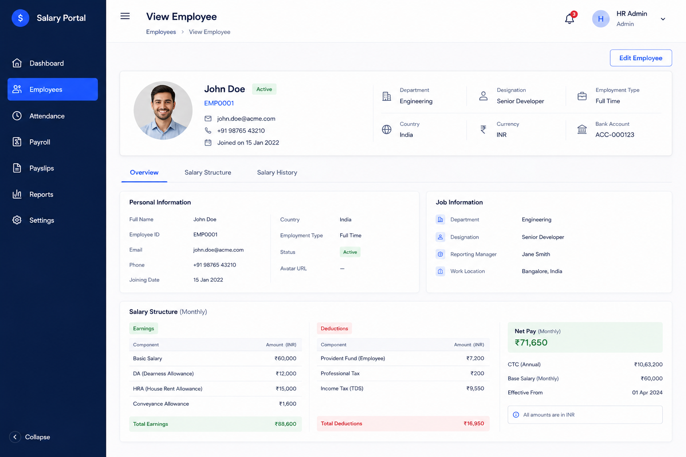

# View Employee Details API

- **Date**: 2026-06-29
- **Status**: draft
- **Author**: BA Planner
- **Persona**: HR Manager

## User Story
As an HR Manager, I want to retrieve one employee's details via a read-only API so that the employee details page can display accurate, complete information for a selected employee.

## Background / Context
The product needs a dedicated backend contract for the employee details page (single employee view). This story defines the API expectations for fetching one employee record by identifier and returning the fields needed by the UI, aligned with the provided employee-details screenshot.

## Scope
### In Scope
- Define a read-only endpoint for fetching one employee by employee ID (GET `/employees/:id`).
- Define the expected success response to match the fields shown in the provided employee details mockup.
- Define basic error behavior for the single-employee lookup scenario.
- Define acceptance criteria focused on API behavior consumed by the details page.

### Out of Scope
- Creating, updating, deleting employees.
- List/search/pagination endpoints.
- Payroll calculations, analytics, or dashboard aggregates.
- Frontend page implementation and styling.
- Authentication/authorization implementation details (assumed handled upstream).

## Brainstorm Notes
- Assumptions:
  - API is read-only for this story and uses GET `/employees/:id`.
  - Response should mirror the fields needed by the screenshot-based employee details page.
  - "Basic error" in this story explicitly includes not-found handling (404).
  - Auth is already enforced by existing middleware/platform controls and is not expanded here.
- Dependencies:
  - Existing employee data source containing the detail attributes shown in UI.
  - Stable employee identifier passed from UI route/context.
  - Frontend details page integration consuming this endpoint contract.
- Edge cases:
  - Employee ID does not exist returns a clear 404 response.
  - Optional profile fields may be missing and should return explicit null/empty-safe values per contract.
  - Invalid or malformed ID behavior may need standardization if route permits non-numeric or non-UUID patterns.
  - Backend should avoid leaking internal-only fields in the response.

## Acceptance Criteria
- [ ] Given a valid employee ID for an existing employee, when the client calls GET `/employees/:id`, then the API returns HTTP 200 with employee detail fields required by the view employee page.
- [ ] Given a successful response, when the payload is inspected, then field names and structure are consistent with the employee details screenshot contract.
- [ ] Given an employee ID that does not exist, when the client calls GET `/employees/:id`, then the API returns HTTP 404 with a clear not-found message.
- [ ] Given a request for one employee, when the API responds, then only one employee object is returned (not an array/list payload).
- [ ] Given missing optional attributes, when the API responds, then the response shape remains valid and parsable by the details page without contract-breaking omissions.

## Screenshots / Mockups
- [2026-06-29-view-employee-page.png](../assets/2026-06-29-view-employee-page.png)

Preview: Employee Details Page Mockup (single employee view)

## Open Questions / Assumptions
- Should the story lock an explicit field-by-field response schema/table in this document, or is “match screenshot fields exactly” sufficient for this iteration?
- Should invalid ID format behavior (for example, wrong type/pattern) be explicitly standardized as HTTP 400 in this same story?
- Is role-based visibility of sensitive fields (if any exist in the details view) intentionally deferred to a separate auth/permissions story?
